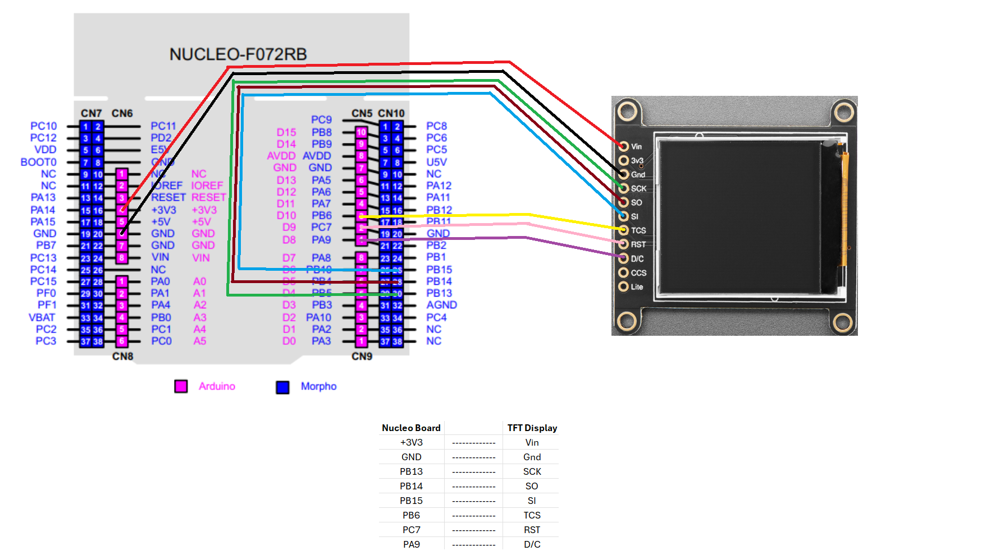
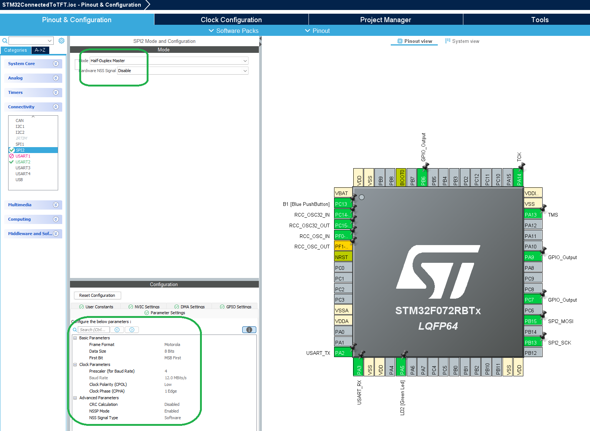
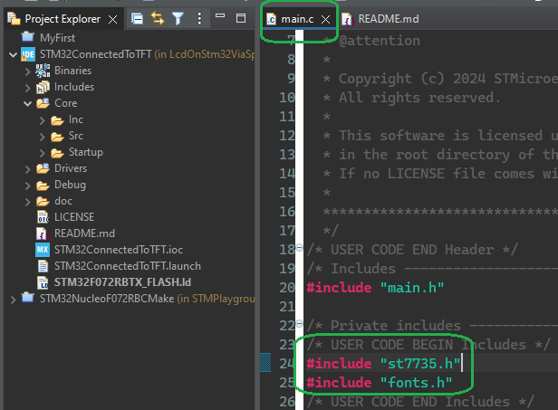
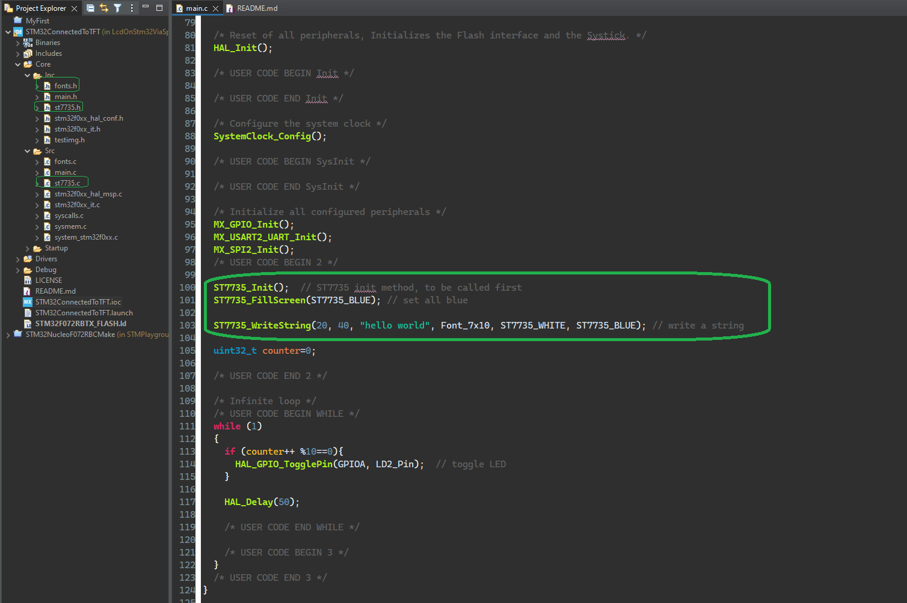

# Lcd On Stm32 Via Spi
Connecting a LCD to a STM32 Nucleo Board F072RB via SPI

# Project
This project connects a STM32 Nucleo-F072RB Board to an Adafruit 1.44" Color TFT via an SPI bus. Additionally to the standart SPI connnections (clock, mosi, miso), the display requires CS, RST and D/C signals.

# Resources
- [Adafruit 1.44" Color TFT](https://learn.adafruit.com/adafruit-1-44-color-tft-with-micro-sd-socket)
- [Nucleo F072RB](https://www.st.com/en/evaluation-tools/nucleo-f072rb.html#:~:text=NUCLEO-F072RB%20-%20STM32%20Nucleo-64%20development%20board)
- [SPI Bus](https://en.wikipedia.org/wiki/Serial_Peripheral_Interface)

# Required Tools
 - [CubeIDE](https://www.st.com/en/development-tools/stm32cubeide.html)
 - Solderless Breadboard
 - Cables

 # Wiring
 

 # Cube IDE Project
 - Start the .cproject file in CubeIDE
 - Note the pin out of the CPU:
     - 
- Additionally the project includes the ST7735 library
  - Needed includes in main
    - 
  - Three methods of the library are being called, ST7735_Init, ST7735_FillScreen and ST7735_WriteString
    - 
- That's all what is needed to write hello world to the display

  

